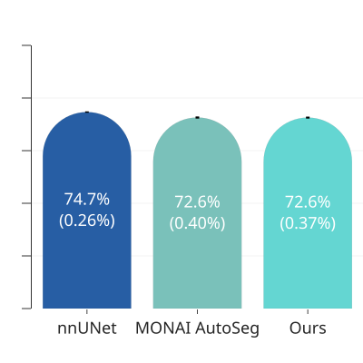
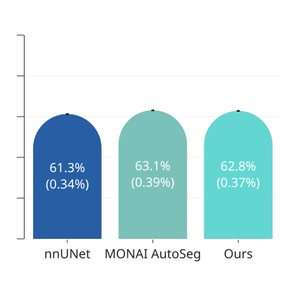

# Automated and manual AI frameworks for MRI: Performance and usability for liver parenchyma segmentation

Daniël Nobbe, L. Zbinden, S. Poli, R. Sznitman, A. Huber  
ARTORG Center for Biomedical Engineering Research, University of Bern, Switzerland  
Inselspital, Bern University Hospital, Switzerland

Thanks for reading our work! Feel free to connect on LinkedIn or send us an email:  
[LinkedIn](https://www.linkedin.com/in/daniel-nobbe/) | [Email](mailto:daniel.nobbe@unibe.ch)

## Introduction
Employing AI models for semantic segmentation of CT and MRI has become a mainstay in clinical research, and has slowly been moving into clinical workflows. Over the last couple of years, nnUNet [1] has developed into the gold-standard segmentation tool. It provides an end-to-end framework, which includes automatically configuring models and inference. Other automatic segmentation frameworks have also been released, e.g. the one by MONAI [2]. Both frameworks have won segmentation challenges [3, 4].

nnUNet and MONAI AutoSeg requires the user to bring their own data, and have varying levels of automation. When using nnUNet, users need to convert their data into a specific format specified by nnUNet, stored on a specific location. The framework then preprocesses the data and prepares a collection of model configurations. The user then needs to trigger training for each of these configurations, and finally determine which ones to use for predictions.
MONAI AutoSeg is a lot simpler -- the user needs to deliver a 'datalist' file, and the AutoRunner handles the rest. Users do need to write a small amount of code to run the framework, and need to manually pick which models to use for prediction later.

With the need to convert data and provide duplicate storage, nnUNet is not fully automatic, but it does abstract away most of the deep learning. As such, we consider the tool to be focussed on use by clinicians and medical researchers working on data collection, not so much on machine learning experts or developers. 
MONAI AutoSeg similarly abstracts away much of the technology.
What both frameworks do very well is allowing researchers to create a strong baseline based on their datasets. In the case of nnUNet, this often results in models that are at the limit of what's possible with a particular dataset. nnUNet usually seems to outperform MONAI AutoSeg [5].

Being machine learning researchers, we have been looking beyond nnUNet and Monai AutoSeg, to a tool that allows us to easily experiment with tweaks to dataset processing, and to easily implement alternative architectures. Indeed, UNet-like architectures that employ convolutions are hard to beat in segmentation, but experimenting with other encoder architectures is being done and should be easy.

We introduce Ignition, a framework based on MONAI Core [2] that is also low-code, and allows easy customisation of models, training settings and dataset. It flexibly loads data from folders, datalists, and reduces the amount of manual steps needed to process the data.

In this work, we show results comparing these three frameworks on an internal dataset, and discuss the benefits of each.

## Dataset
We use the dataset of [6], a segmentation dataset focussed on liver parenchyma and veins.
It contains eleven classes, all related to the liver: 9 liver segments and the portal and hepatic veins. The dataset contains 200 patients, most of them suffering from chronic liver disease (CLD). 170 patients are used for the training set and 30 for the held-out testing set.

## Methods
We compare the three frameworks, after training with five-fold cross-validation on the train portion of the dataset, and provide scores on the test set.

### Ignition
Ignition is built on a skeleton of PyTorch Ignite, using training primitives from MONAI Core, custom dataset processing built on top of MONAI Core, and combines custom transforms with MONAI Core transforms. As such, it uses a lot of code from MONAI, but does not use MONAI Bundles, which is what MONAI AutoSeg is based on.

A training or evaluation run is entirely defined by a set of configuration files, where the user only has to define the _main_ configuration file, which includes settings related to loss functions, training length, dataset, batch sizes, and geometry. We provide strong default settings, so users only need to change their dataset, spacing, patch size, and optionally batch size.
We also provide a script to analyse a dataset, which gives a median image size and spacing, to be used for patch size and spacing respectively. Note that our default settings have not yet been validated across a wide range of datasets.

We provide our training configuration in [scr26.yaml](configs/scr26.yaml).

### MONAI AutoSeg
MONAI AutoSeg by default trains three different types of models: DiNTS, SegResNet, and SwinUNETR. In our experiments, ususally the SegResNet works the best. 

### nnUNet
nnUNet builds a number of configurations, in addition to the defaults we also triggered the residual encoder M configuration. The 3D default configuration worked best and is what we report here.

### Evaluation
We use an external script to evaluate the models, to prevent ambiguity in the Dice scores we determine. To be specific, we calculate the Dice score individually for each class, only considering the foreground classes, and then compute the mean over all these classes. We then provide the mean of the foreground Dice score over the five cross-validation models, and the standard deviation over the five cross-validation models.

## Results
The three frameworks are quite close, with nnUNet inching out the others in Dice score. Overall, the two MONAI-based systems reach very nearly identical scores, with an insignificant difference. Interestingly, the IoU of MONAI AutoSeg and our Ignition models are slightly higher.
<figure>
  
  <figcaption>
    Figure 1. Foreground Dice score for the three frameworks.
  </figcaption>
</figure>
<!-- \ -->

<figure>
  
  <figcaption>
    Figure 2. Foreground IoU score for the three frameworks.
  </figcaption>
</figure>

## Discussion
Overall, we see that nnUNet is still a bit better than the other frameworks, and that we did not manage to manually tweak our model to outperform even the MONAI AutoSeg framework. Our future steps include looking at improved data augmentation and sampling.

# References

1. Isensee, F., Jaeger, P. F., Kohl, S. A., Petersen, J., & Maier-Hein, K. H. (2021).
nnU-Net: a self-configuring method for deep learning-based biomedical image segmentation.
Nature Methods, 18(2), 203-211.
2. M Jorge Cardoso, Andrew Feng, Wenqi Li, Richard Brown, Nic Ma, Eric Kerfoot, Yiheng Wang, Benjamin Murrey, Andriy Myronenko, Can Zhao, Dong Yang, Vishwesh Nath, Yufan He, Ziyue Xu, Ali Hatamizadeh, Andriy Myronenko, Wentao Zhu, Yun Liu, Mingxin Zheng, Yucheng Tang, Isaac Yang, Michael Zephyr, Behrooz Hashemian, Sachidanand Alle, Mohammad Zalbagi Darestani, Charlie Budd, Marc Modat, Tom Vercauteren, Guotai Wang, Yiwen Li, Yipeng Hu, Yunguan Fu, Benjamin Gorman, Hans Johnson, Brad Genereaux, Barbaros S Erdal, Vikash Gupta, Andres Diaz-Pinto, Andre Dourson, Lena Maier-Hein, Paul F Jaeger, Michael Baumgartner, Jayashree Kalpathy-Cramer, Mona Flores, Justin Kirby, Lee A D Cooper, Holger R Roth, Daguang Xu, David Bericat, Ralf Floca, S Kevin Zhou, Haris Shuaib, Keyvan Farahani, Klaus H Maier-Hein, Stephen Aylward, Prerna Dogra, Sebastien Ourselin. 2022. ‘MONAI: An Open-Source Framework for Deep Learning in Healthcare’. arXiv:2211.02701.
3. Myronenko, Andriy, Dong Yang, Yufan He, and Daguang Xu. 2023. ‘Automated 3D Segmentation of Kidneys and Tumors in MICCAI KiTS 2023 Challenge’. doi:10.48550/arXiv.2310.04110.
4. Isensee, Fabian, Constantin Ulrich, Tassilo Wald, and Klaus H. Maier-Hein. 2022. ‘Extending nnU-Net Is All You Need’. doi:10.48550/arXiv.2208.10791.
5. Isensee, Fabian, Tassilo Wald, Constantin Ulrich, Michael Baumgartner, Saikat Roy, Klaus Maier-Hein, and Paul F. Jaeger. 2024. ‘nnU-Net Revisited: A Call for Rigorous Validation in 3D Medical Image Segmentation’. doi:10.48550/arXiv.2404.09556.
6. Zbinden, Lukas, Damiano Catucci, Yannick Suter, Leona Hulbert, Annalisa Berzigotti, Michael Brönnimann, Lukas Ebner, et al. 2023. ‘Automated Liver Segmental Volume Ratio Quantification on Non-Contrast T1–Vibe Dixon Liver MRI Using Deep Learning’. European Journal of Radiology 167: 111047. doi:10.1016/j.ejrad.2023.111047.
